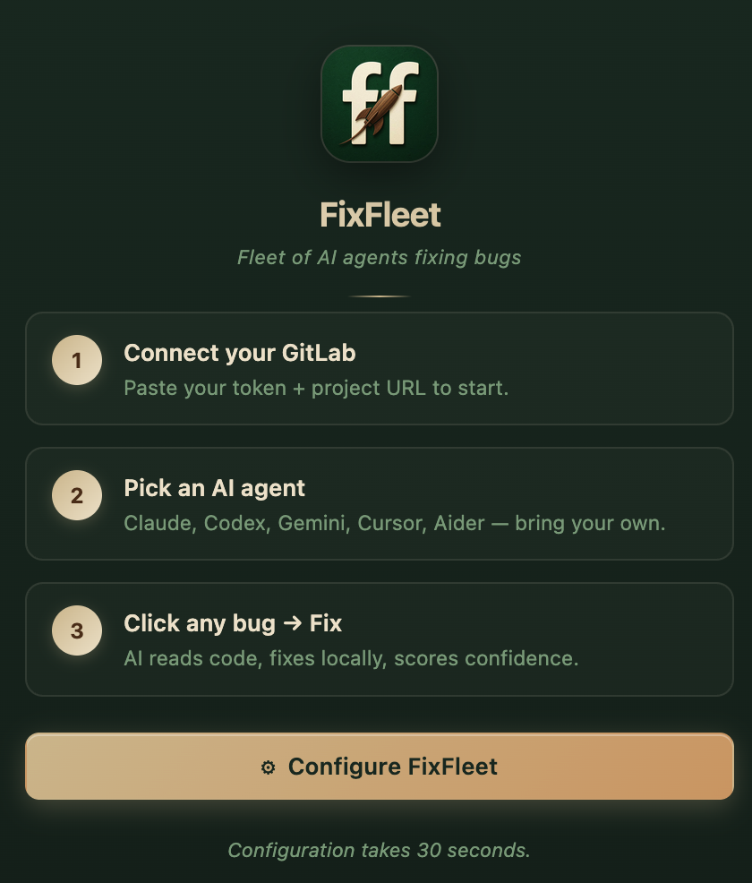
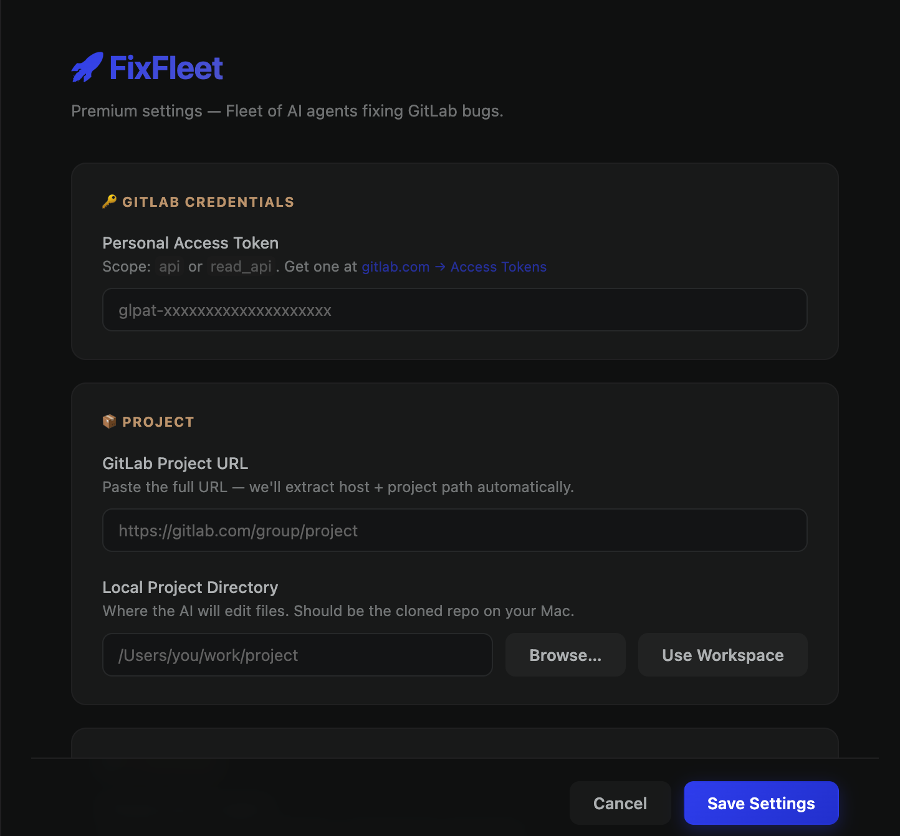
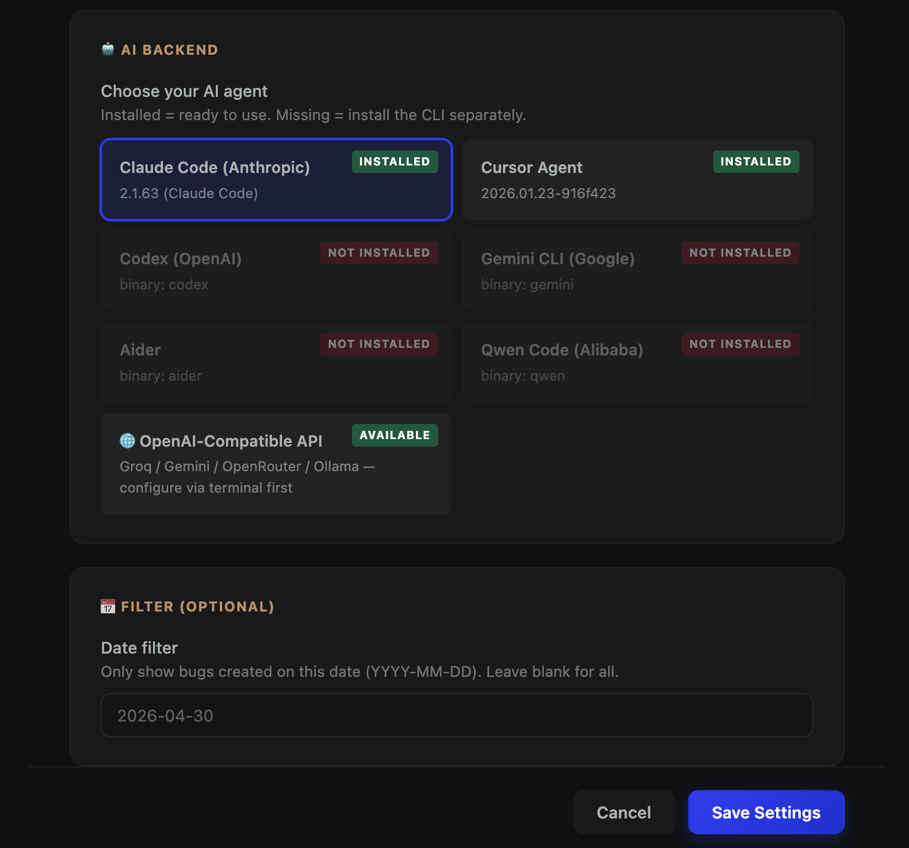

# 🚀 FixFleet — AI Bug Fixer for GitHub, GitLab, Jira, Linear, Bitbucket & Azure DevOps

> **Auto-fix bugs from any issue tracker with AI agents — directly inside VSCode.**

Premium UI on top of the [FixFleet](https://github.com/Yash-Koladiya30/fixfleet) Python CLI.

---

## 📸 Screenshots

### Welcome — 3-step onboarding



### Settings — credentials + project



### Settings — AI backend grid + date filter



---

## 🔌 Supported Issue Trackers

| Tracker | Bug filter | Token format |
|---|---|---|
| 🟧 **GitLab** | label `Bug` | `glpat-...` |
| ⬛ **GitHub** | label `bug` | `ghp_...` |
| 🟦 **Jira** | Issue Type = Bug | `email:api-token` |
| 🟪 **Linear** | label `Bug` | `lin_api_...` |
| 🟫 **Bitbucket** | kind = bug | `username:app-password` |
| 🟦 **Azure DevOps** | Type = Bug | PAT alone |

Paste any project URL — **provider is auto-detected**. Full step-by-step token guides in the [repository README](https://github.com/Yash-Koladiya30/fixfleet#-connect-your-tracker-token-setup-guides).

---

## ✨ Features

- 🐛 **Sidebar bug list** with priority badges (High / Medium / Low) sorted by priority
- 🔌 **6 issue trackers** — GitHub, GitLab, Jira, Linear, Bitbucket, Azure DevOps
- 📅 **Date range filter** — From / To inputs in the sidebar toolbar
- ☑️ **Multi-select + batch fix** — tick multiple bugs, fix sequentially with live progress bar
- 🎨 **Premium webview** for each bug — description, steps, expected/actual, logs all parsed automatically
- ✨ **One-click "Fix this bug"** — dispatches to your chosen AI agent
- 📊 **Confidence score** — see how sure the AI is before reviewing
- ⚙️ **Visual settings** — pick provider, configure token, project, backend without touching JSON
- 🎯 **Multi-backend AI** — Claude Code, Codex, Gemini, Cursor, Aider, Qwen, or any OpenAI-compatible API (Groq / Ollama / OpenRouter)
- 🔐 **Structured error states** — token rejected · project not found · network error · CLI missing — each with one-click recovery
- 🔁 **Status bar** — live count of open bugs and current fix progress

## 📦 Install

### From VSCode Marketplace
Search `FixFleet` in the Extensions panel.

### Manual
```bash
code --install-extension fixfleet-<version>.vsix
```

## 🛠 Setup

1. Install the FixFleet CLI (Python):
   ```bash
   pip3 install --user fixfleet
   ```
   Add user-bin to PATH (one-time):
   ```bash
   echo 'export PATH="$(python3 -m site --user-base)/bin:$PATH"' >> ~/.zshrc
   source ~/.zshrc
   ```
2. Open VSCode → click the 🚀 FixFleet icon in the activity bar
3. Click **Configure FixFleet**
4. Pick your **issue tracker provider** (GitHub / GitLab / Jira / Linear / Bitbucket / Azure DevOps)
5. Paste your access token + project URL → save ([token guides](https://github.com/Yash-Koladiya30/fixfleet#-connect-your-tracker-token-setup-guides))
6. Click any bug in the sidebar → see detail → click **Fix This Bug**

## 🎨 Design

Premium natural palette extracted from the FixFleet icon:
- Forest green + cream ivory + walnut brown + champagne gold
- Glassmorphism cards adapting to light + dark themes
- Confidence gradient bars
- Per-card status badges with pulsing animation during fix

## 🔒 Privacy

- No FixFleet servers — your token + code go directly from your machine to your tracker + AI provider
- Never commits, never pushes — leaves changes for your review
- No telemetry

## 📝 License

**GNU General Public License v3.0 or later (GPL-3.0-or-later)** — see [LICENSE](LICENSE).

Derivative works must also be open-source under GPL-3. No closed-source forks.

Built by [Yash Koladiya](https://github.com/Yash-Koladiya30). © 2026.
